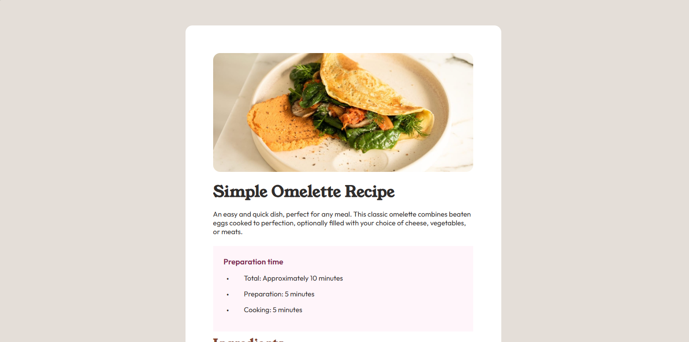
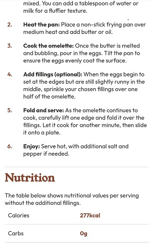

# Frontend Mentor - Recipe page solution

This is a solution to the [Recipe page challenge on Frontend Mentor](https://www.frontendmentor.io/challenges/recipe-page-KiTsR8QQKm). Frontend Mentor challenges help you improve your coding skills by building realistic projects. 

## Table of contents

- [Overview](#overview)
  - [The challenge](#the-challenge)
  - [Screenshot](#screenshot)
  - [Links](#links)
- [My process](#my-process)
  - [Built with](#built-with)
  - [What I learned](#what-i-learned)
  - [Continued development](#continued-development)
  - [Useful resources](#useful-resources)
- [Author](#author)

**Note: Delete this note and update the table of contents based on what sections you keep.**

## Overview

### The challenge

This is a Frontend Mentor challenge on HTML and CSS that deals with designing a of a recipe page. It is aimed at testing one's skill on how to create responsive webpages with focus on semantic HTML.

This time aarounf I decided to approach this challenge  by doing away with the extra parent div container element I usually used in applying the center alignment effect and and applied those styles to the body tag instead. I wanted to experiment how it will appear and considering the fact that the whole challenge is a test on semantic HTML, using fewer to none div containers is better in my own opinion.  

### Screenshot




The screenshot do not show the entire contents of the page as the page span over 1 viewport height.


### Links

- Solution URL: [GitHub](https://github.com/kmdcodes/recipe-page-main)
- Live Site URL: [Vercel](hhttps://recipe-page-main-ten-azure.vercel.app/)

## My process

### Built with

- Semantic HTML5 markup
- CSS custom properties
- Flexbox
- CSS Grid
- Fonts used : [Outfit](https://fonts.google.com/specimen/Outfit) and [Young Serif](https://fonts.google.com/specimen/Young+Serif)


### What I learned

I learnt how to better style table components as it was the most challenging part of this project. Getting the table to look like a replica of the in the challenge was tough but at the end I eventually learnt that I was applying the styles on the wrong selectors. I made correction to the styles and restyled it to work as expected. To me this was something new becaause I never looked up how  to style tables as I hadly used them in my pages. 

Below is a snippet of the css styles for the table.

```html
 <table>
    <tr>
        <td> Calories </td>
        <td class="qty emph">277kcal </td>
    </tr>
    <tr>
        <td> Carbs </td>
        <td class="qty emph">0g </td>
    </tr>
    <tr>
        <td> Protein </td>
        <td class="qty emph">20g </td>
    </tr>
    <tr>
        <td> Fat </td>
        <td class="qty emph">22g </td>
    </tr>
</table>
```
```css
table{ 
    width: 100%;
    border-collapse : collapse;
    }

td, th{
    width : 50%;
    border-bottom : 1px solid color-mix(in srgb, var(--text-grey-black) 30%, transparent);
    padding : 0.8rem 0.5rem;
    
}

tr:last-child td{
    border-bottom : none;
}
```

### Continued development

I did not experiment with much of the areas, I wanted to improve on as I was focused on making my design to closely replicate the design files. 
However, I did utilise previously learned concepts such as custom properties, custom fonts, optimise way of using the grid and flexbox display to align contents. 
For an area of continued development I will like to work on how to better adding transitions to my styles making it smoother, more efficient and more sleek.


### Useful resources

- [Microsoft Copilot](https://copilot.microsoft.com/) - This tool as always, was of tremendous use to me and the completion of the challenge as it acts as a partner and support when I run out of ideas from trying to figure out to do a certain task or my brainstorming hits rock bottom. It acts as a tool to help reawakening my creativity and productivity by helping me answer questions concerning confusing areas. I recommend you make use of Microsoft Copilot too. Its a great tool.


## Author

K.M. Daniel
- Frontend Mentor - [@kmdcodes](https://www.frontendmentor.io/profile/kmdcodes)
- Twitter - [@kmdbank](https://x.com/kmdbank)
- Facebook - [@kmdbank](https://facebook.com/kmd4life)
